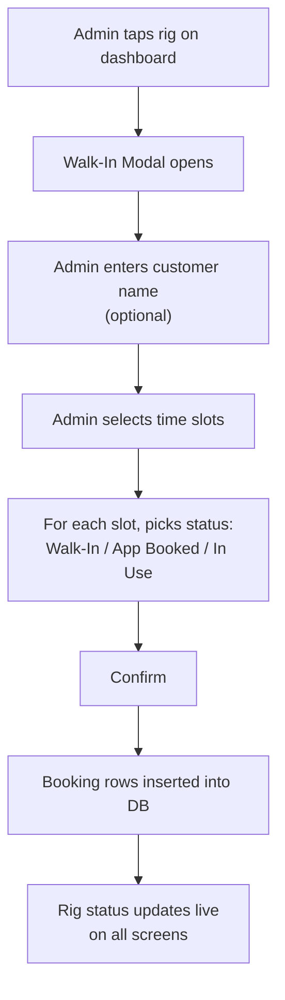
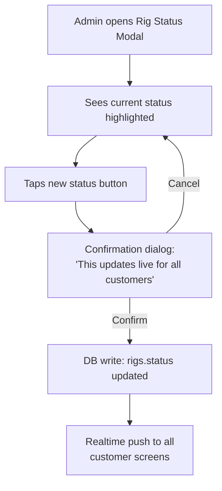
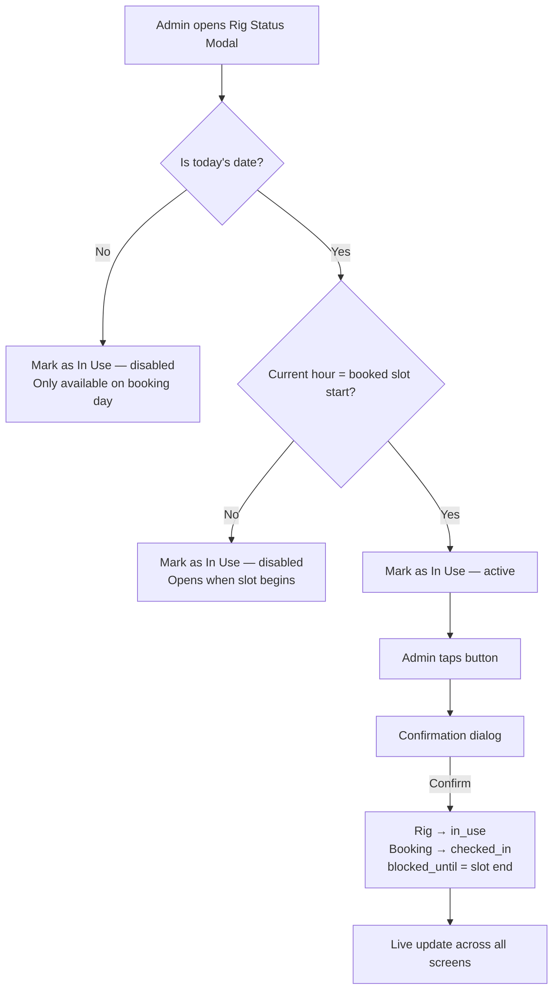
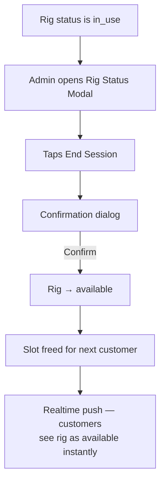
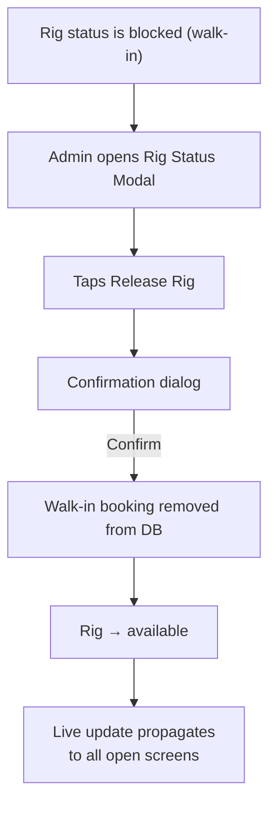
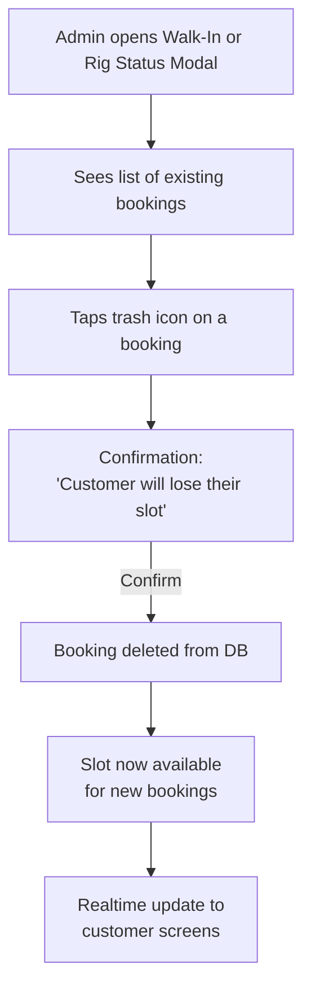
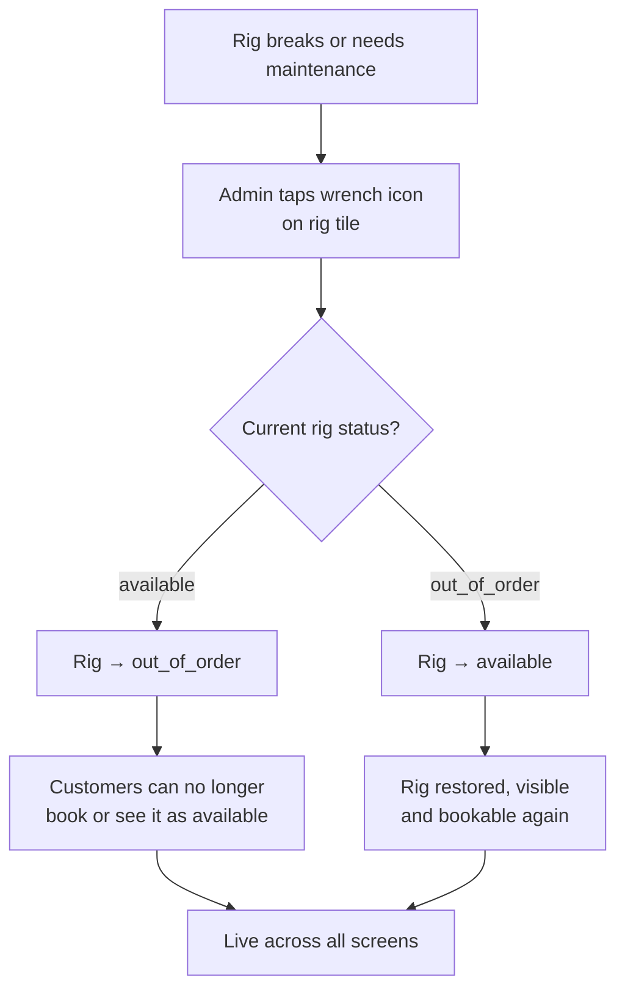
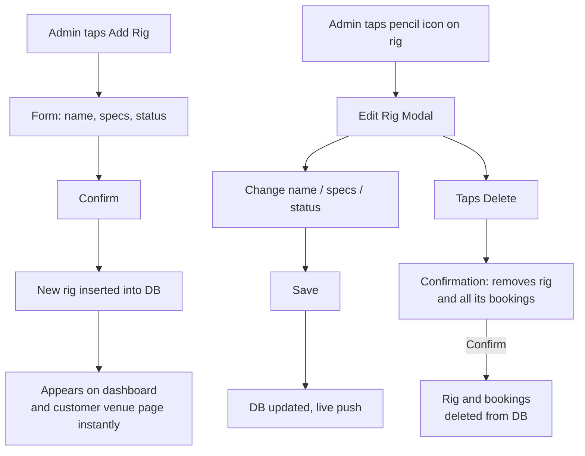
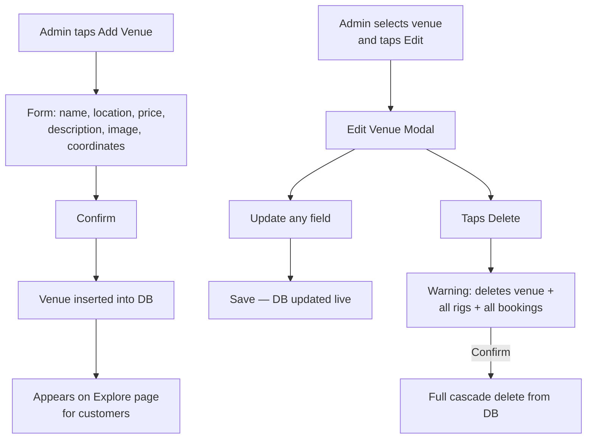
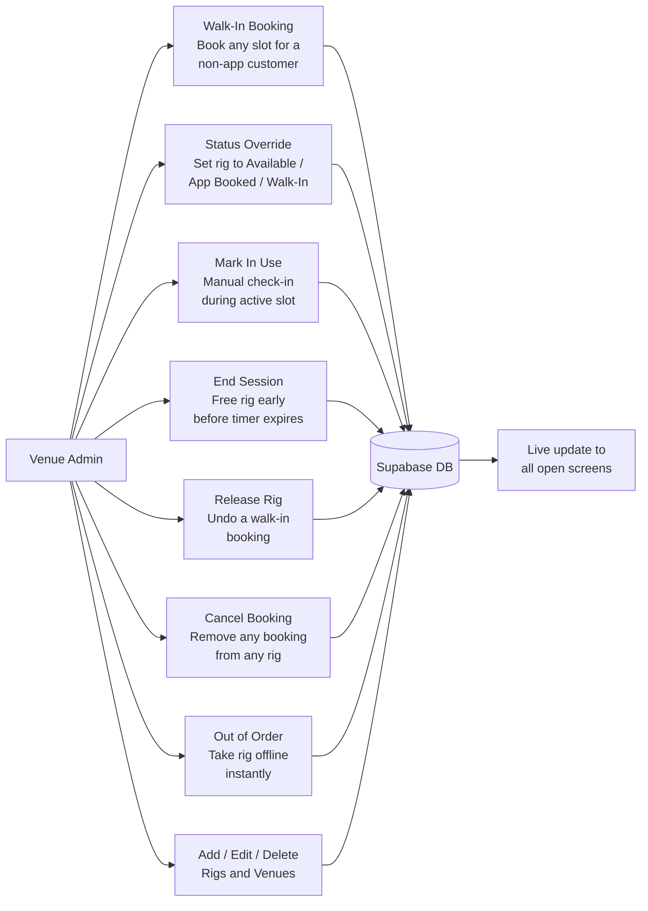

# Part 3 — Manual Admin Controls for Ease of Operability

## Overview

PitPass gives venue owners a full set of manual controls so they are never dependent on customers taking the right steps or the system doing everything automatically. Every real-world situation a venue faces — a walk-in who didn't book online, a rig that suddenly breaks, a customer who needs to be removed from a slot, a new simulator being added to the floor — can be handled directly from the admin dashboard without touching a database or calling support.

All controls are in one place: the admin dashboard. Each action goes directly to the database and propagates live to every customer screen watching that venue.

---

## 1. Walk-In Booking

The most common manual action at any gaming cafe is handling a customer who just walks through the door without a prior booking. Rather than turning them away or managing them off-system in a notebook, admins can book them directly.

Tapping any rig on the dashboard opens the **Walk-In Modal**. The admin selects a customer name (optional), picks the time slots, and for each slot chooses how to label it: Walk-In (standard), App Booked (if entering a booking made via a different channel), or In Use (if the customer is sitting down right now during the current hour).

The system only shows today as a date option here — walk-ins are always immediate. Slots that are already booked or in the past are greyed out and unclickable, so the admin cannot accidentally double-book.

---

## 2. Manual Rig Status Override

Sometimes a rig's status needs to be changed immediately without going through a full booking flow. A customer cancelled verbally, a rig freed up early, or an admin made an error — the **Rig Status Modal** lets them correct it in two taps.

From the modal, the admin can set any rig to:

- **Available** — rig is free, visible to customers as bookable
- **App Booked** — marks it as taken by an online booking
- **Walk-In** — marks it as taken by a walk-in customer

Each change asks for a confirmation before writing to the database, because a status change is immediately visible to every customer browsing the venue. This prevents accidental taps from incorrectly flipping a rig's state.

---

## 3. Mark as In Use (Manual Check-In)

When a customer is physically sitting down at a rig — whether they booked via the app or walked in — the admin can manually mark that rig as **In Use** from the Rig Status Modal, without scanning a QR code.

This button only activates when:

1. The date is today
2. The current hour matches the start of a booked slot for that rig

If those conditions are not met, the button is greyed out with an explanation — either "Check-in opens when the booked slot begins" or "Check-in is only available on the booking day." This prevents staff from accidentally marking a rig in use for the wrong slot.

---

## 4. End Session

When a customer finishes early or the admin needs to free up a rig that is currently **In Use**, the **End Session** button appears in the Rig Status Modal. One tap (plus a confirmation) sets the rig back to `available` and frees the slot for the next customer — immediately visible across the dashboard and on any customer browsing that venue.

This is the manual version of the auto-release that normally happens when `blocked_until` passes. It is used when the admin needs to act before the timer expires — for example if a session runs short.

---

## 5. Release Walk-In

If a walk-in slot was reserved but the customer didn't show up, or the admin needs to undo a walk-in booking, the **Release Rig** button removes the walk-in booking entirely and resets the rig to `available`.

This is distinct from End Session — Release is specifically for rigs in the `blocked` (walk-in) state, and it deletes the booking rather than just marking it complete.

---

## 6. Cancel a Booking

From either the Walk-In Modal or the Rig Status Modal, admins can cancel any individual booking directly — no need to contact the customer or process it elsewhere. Each booking row in the modal has a trash icon. Tapping it shows a confirmation, then permanently removes that booking record.

This works for both app-sourced and walk-in bookings, and takes effect immediately. The slot it occupied becomes available again for new bookings.

---

## 7. Toggle Out of Order

The wrench icon on any rig tile on the main dashboard toggles it between `available` and `out_of_order`. This is a quick one-tap action designed for when a rig breaks mid-session and needs to be pulled from service immediately.

When `out_of_order`, the rig is hidden from customers as a bookable option. The admin can restore it with another tap of the same icon. There is no confirmation dialog for this — it is intentionally fast because a broken rig needs to be taken offline without delay.

---

## 8. Add / Edit / Delete a Rig

Venue owners can manage their full rig inventory from the dashboard without any backend access. The **Add Rig** button opens a form to create a new simulator with a name, specs (hardware description), and initial status. The **Edit** (pencil) icon on any rig lets them rename it, update specs, change status, or delete it entirely.

Deleting a rig is a hard delete with a confirmation — it removes the rig and cascades to all associated bookings. The system warns the admin before proceeding.

---

## 9. Add / Edit / Delete a Venue

Admins who manage multiple locations can add, edit, or remove entire venues from the dashboard. The **Add Venue** form collects name, location, pricing, description, image URL, and map coordinates (latitude/longitude for the map view on the Explore page).

Editing updates any of those fields. Deleting a venue cascades — it removes all rigs and their bookings associated with that venue, so admins are shown a clear warning before confirming.

---

## Summary — What the Admin Can Control Manually

Every one of these actions writes directly to the database and propagates via Supabase Realtime to every open customer screen within seconds. Admins are never working in a local view that conflicts with what customers see — the dashboard and the customer app are always looking at the same live data.
