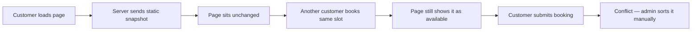
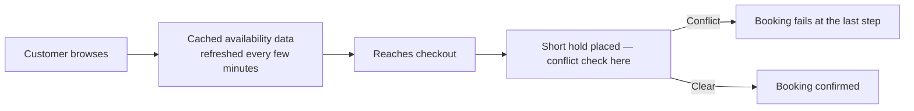
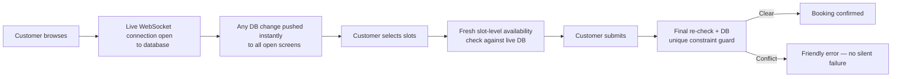
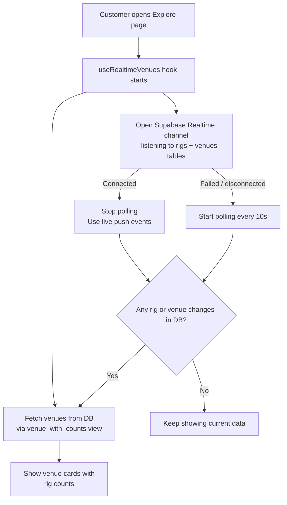
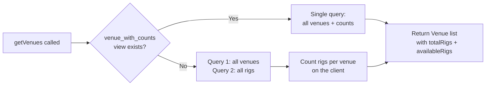
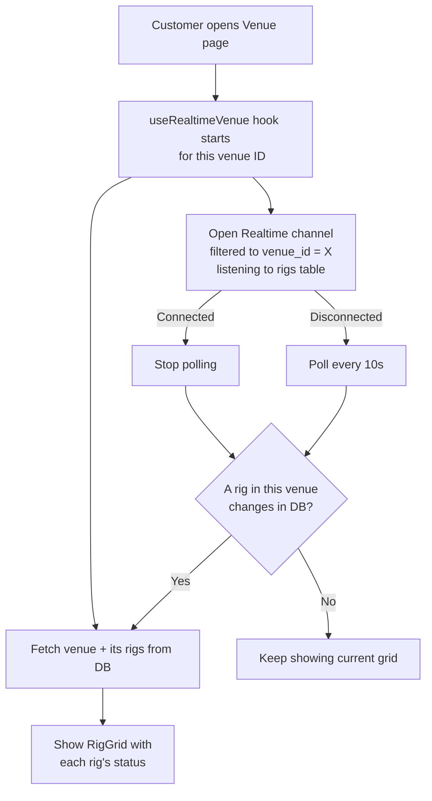
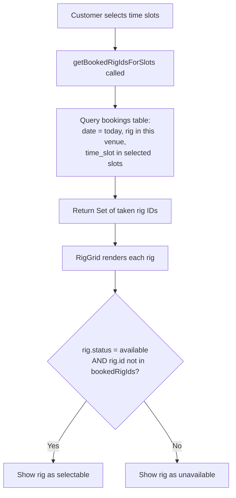
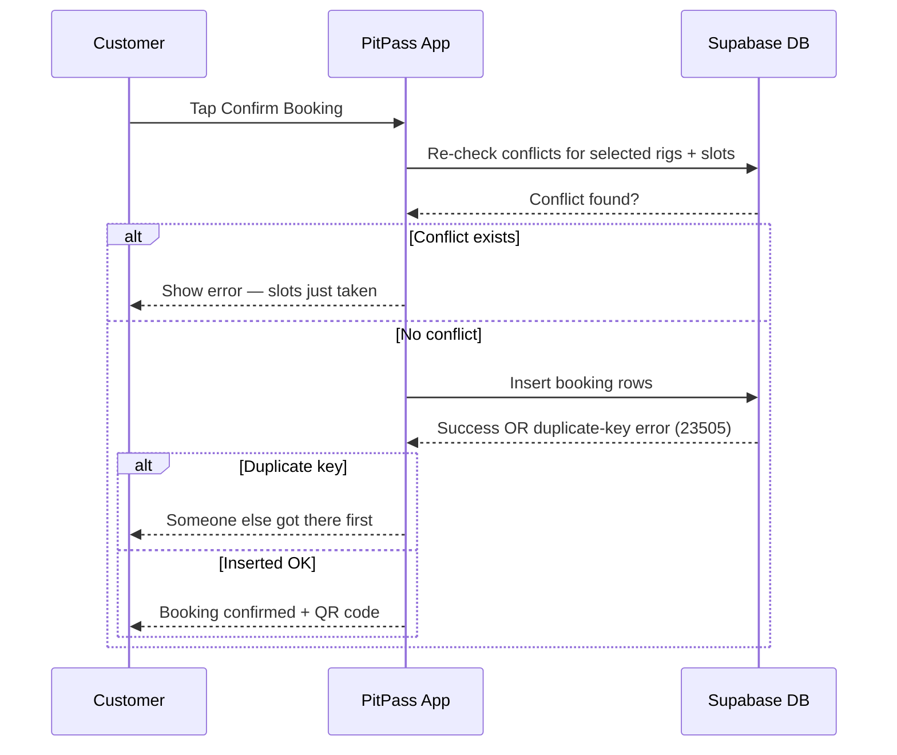
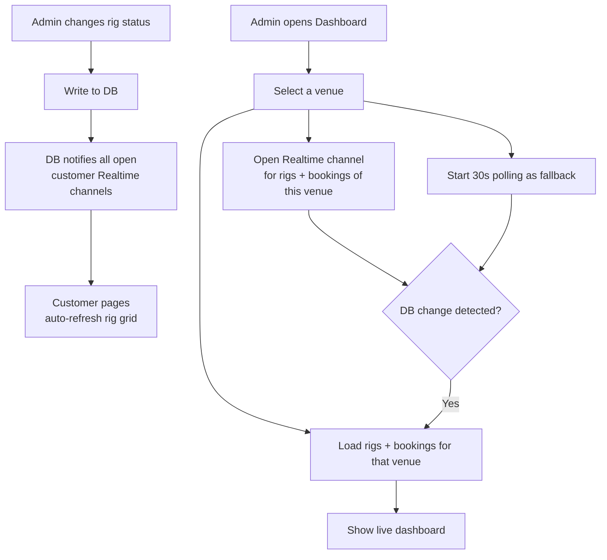
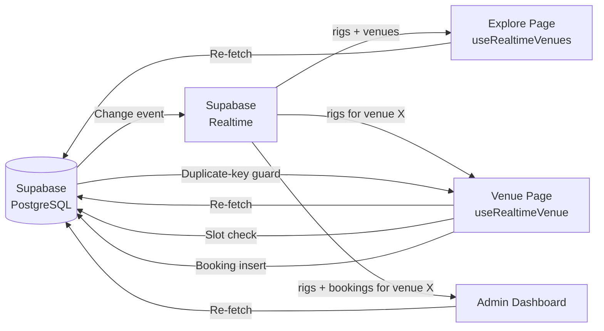

# How Live Rigs and Slot Availability Works in PitPass

## Overview

PitPass shows customers which gaming rigs are available right now — and keeps that view up to date in real time as other customers book, admins change rig status, or slots fill up. This document explains how that live data flows from the database all the way to what a customer sees on screen.

---

## How PitPass Compares to Other Booking Platforms

Most booking platforms were not built for environments where availability changes by the second. They were designed for hotels, restaurants, or appointment slots — contexts where a booking is made hours or days in advance and nothing changes between the customer browsing and the customer confirming. Gaming cafes operate completely differently: multiple rigs across PC, PlayStation, Xbox, racing setups, and VR — hourly slots, walk-ins happening at the front desk while online customers are mid-booking. The existing solutions simply were not built for this.

---

### Traditional Venue Booking Software (SimplyBook, Bookeo, etc.)

Generic booking tools like SimplyBook.me or Bookeo work on a **request-and-snapshot** model. When you open the availability page, the server sends you a static picture of what was free at that exact moment. The page does not update itself. If someone else books a slot while you are looking at it, you will not find out until you hit Confirm and the system throws an error — or worse, lets both bookings through and flags it for the admin to sort out manually.

These platforms also rely entirely on the customer or admin to manually refresh. There is no push mechanism. For a hair salon booking two weeks out, this is fine. For a sim rig that might get snapped up in the next thirty seconds, it is not.

---

### Large Consumer Platforms (Airbnb, Booking.com)

Platforms like Airbnb do have some level of real-time conflict prevention, but it works differently. Their model is **lock-on-checkout** — availability is only truly confirmed when you reach the payment screen and a short hold is placed on the listing. The browsing experience is still based on cached data, often refreshed every few minutes at best. For accommodation with a single unit (one house, one room), this window is acceptable. For a venue with ten rigs and twelve hourly slots, a few-minute cache lag means customers could be browsing completely wrong data for the entire duration of their session.

They also do not have anything resembling a live admin dashboard. Hosts on Airbnb see their calendar update periodically, not in real time. A sim venue admin who needs to block a rig immediately because it just broke mid-session cannot rely on that kind of delay.

---

### How PitPass Does It Differently

PitPass uses **Supabase Realtime**, which is a persistent WebSocket connection between the app and the database. The moment any rig status changes or any booking is inserted in the database, that change is pushed to every open browser tab viewing that venue — no polling, no page refresh, no cache expiry window.

On top of that, PitPass adds a **slot-level availability check** that most generic platforms do not have at all. It is not enough to know a rig is marked available — it needs to know whether that specific rig is already booked for the specific hour you want. This query runs against the live database every time a customer changes their slot selection, not once at page load.

Finally, at the moment of submission, PitPass does one more fresh database read and relies on a **database-level unique constraint** as the last line of defence. Even if two customers somehow pass every earlier check simultaneously, the database itself will only let one insert succeed.

---

### Side-by-Side Comparison

| | Generic Booking Tools | Large Consumer Platforms | PitPass |
|---|---|---|---|
| Availability data freshness | Static snapshot at page load | Cached, refreshed every few minutes | Live push via WebSocket |
| Admin dashboard updates | Manual refresh | Periodic sync | Real-time + 30s polling fallback |
| Slot-level conflict check | Rarely — usually just date-level | Date + unit level | Per-rig, per-slot, per-date |
| Double-booking prevention | Application-level only | Hold at checkout | Re-check at submit + DB constraint |
| Offline rig propagation | Manual — admin contacts customers | N/A | Instant — customers see it update live |
| Built for multi-rig, hourly slots | No | No | Yes |

---

## Part 1 — Live Rig Status on the Explore Page

When a customer opens the Explore page to browse venues, the app immediately fetches all venues and their rig counts. It then opens a live connection to the database so that if any rig changes (someone books one, an admin blocks it, etc.), the page refreshes automatically — no manual reload needed.

The primary mechanism is a **Supabase Realtime channel**. Think of it like a phone line between the app and the database. When anything in the `rigs` or `venues` table changes, the database calls the app and the app re-fetches the latest data. If that phone line drops (bad network, server hiccup), the app falls back to **polling every 10 seconds** until the live connection is restored.

### How the count is calculated

The database has a special **view called `venue_with_counts`** that pre-calculates total rigs and available rigs for every venue. This means one fast database call returns everything. If that view doesn't exist (e.g. on an older environment), the app falls back to fetching venues and rigs separately and counting them on the client side.

---

## Part 2 — Live Rig Status on the Venue Booking Page

When a customer clicks into a specific venue to book, the app loads that venue's individual rigs with their exact statuses (`available`, `booked`, `blocked`, `out_of_order`, `in_use`). It then opens a **venue-specific Realtime channel** that only watches rigs belonging to that venue — so the app isn't processing noise from other venues.

Same fallback pattern: if the live channel drops, polling every 10 seconds kicks in.

---

## Part 3 — Slot-Level Availability (Which Rigs Are Free for My Chosen Time?)

A rig's status alone is not enough. A rig marked `available` might still be booked by someone else for the 3pm–4pm slot. So when a customer selects one or more time slots, the app runs a second query: **"which rigs at this venue already have a booking for these exact slots on this date?"**

This returns a set of rig IDs that are taken. The `RigGrid` component then combines two checks before showing a rig as bookable:

1. The rig's own status must be `available` (not blocked/out of order/in use)
2. The rig must not be in the booked-for-these-slots set

---

## Part 4 — Final Safety Check at Booking Submission

Between a customer selecting a rig and actually hitting Confirm, someone else could grab it. To handle this, the app does **two more checks at submit time**:

1. **Client-side re-check** — re-fetches fresh booked rig IDs right before submitting, catches conflicts that happened in the last few seconds.
2. **Database-level constraint** — the bookings table has a unique constraint on `(rig_id, time_slot, booking_date)`. If two customers submit at exactly the same moment, the database rejects the second insert with a duplicate-key error, which the app surfaces as a friendly "those slots were just taken" message.

---

## Part 5 — Admin Dashboard (Real-Time View for Venue Staff)

The admin dashboard works similarly but watches **both rigs and bookings** for the selected venue. Unlike the customer hooks, the admin side runs polling every 30 seconds unconditionally alongside the realtime channel — a belt-and-suspenders approach since admins need accuracy for check-ins.

Admins can also manually change a rig's status (block it, mark it out of order, etc.), which triggers a DB write that immediately propagates back to any customers viewing that venue via the realtime channels described above.

---

## Summary — The Full Picture

The key idea: **the database is always the source of truth**. Realtime channels are just a fast notification system that tells the app "something changed, go re-read." All the actual availability logic (rig status + slot bookings + conflict prevention) runs against live database reads, so there is no stale cache that can mislead a customer.
