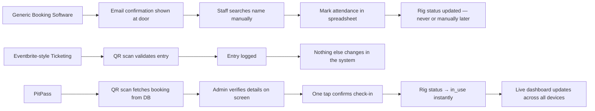
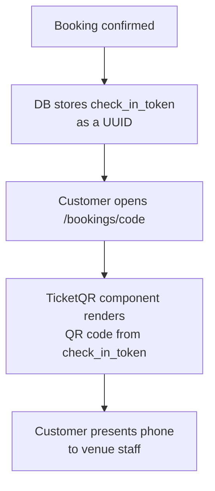
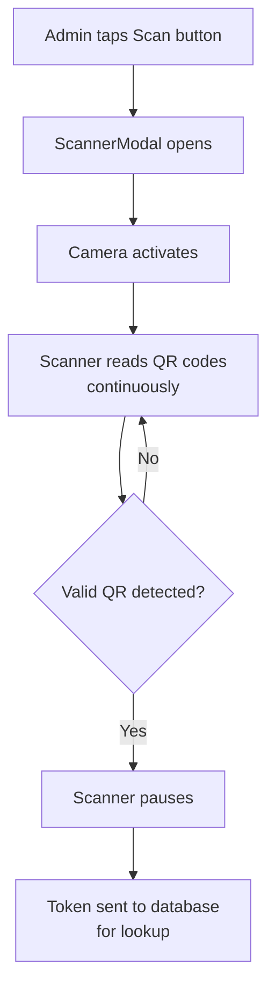
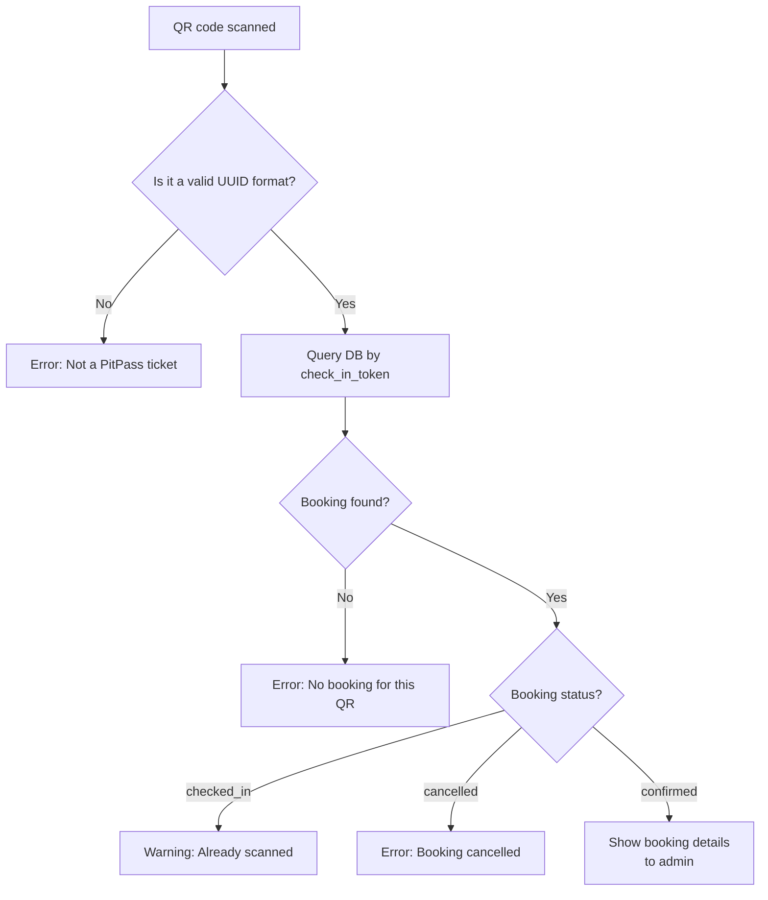
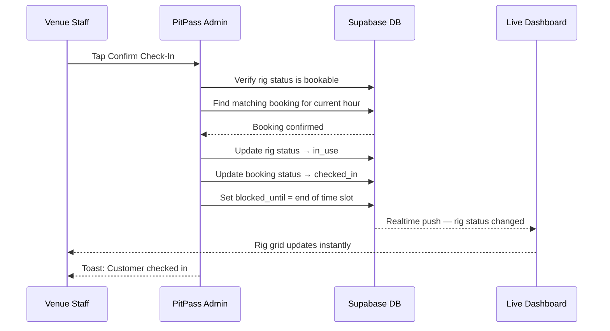
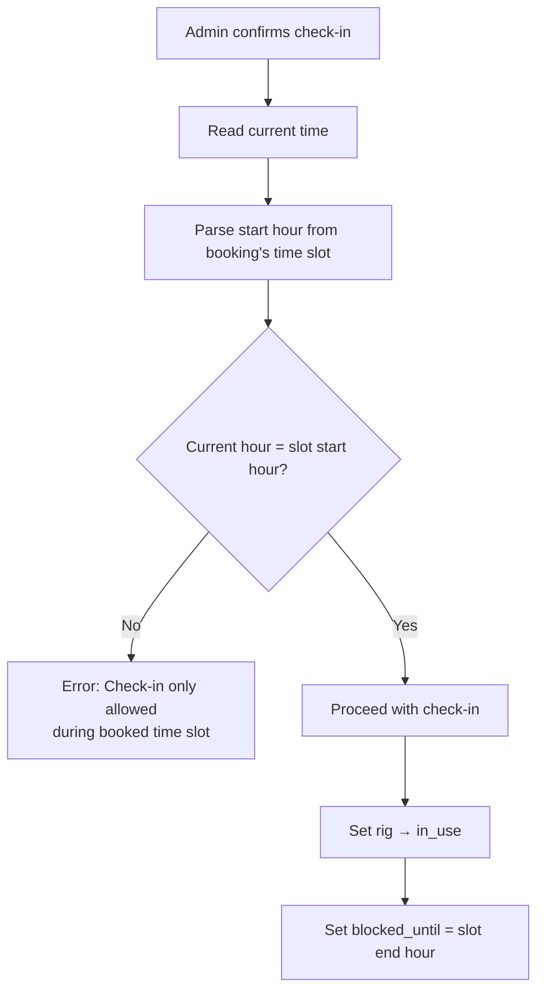
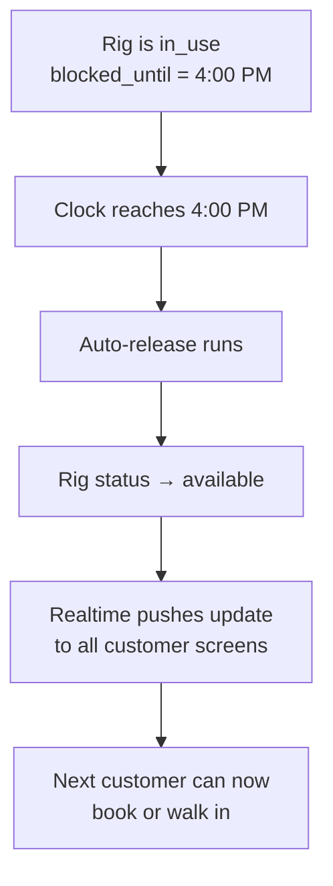
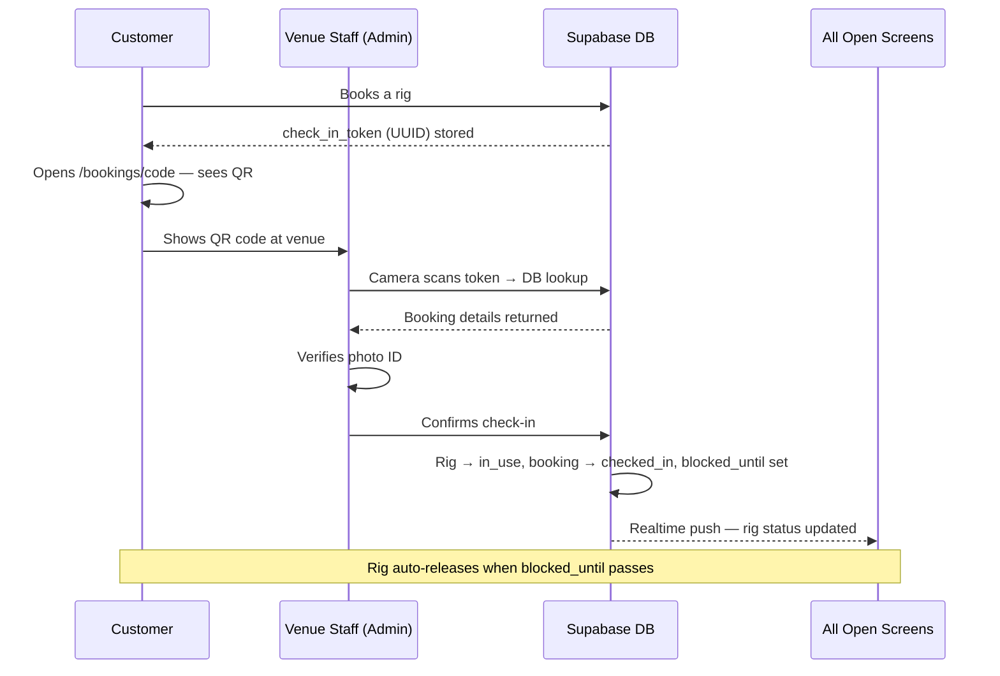

# Part 2 — QR Based Check-In for Instant Access

## Overview

Every confirmed booking on PitPass generates a unique QR code that acts as the customer's ticket. When the customer arrives at the venue, staff scan this code using a camera on any device — no paperwork, no verbal confirmation, no searching through a spreadsheet. The scan instantly pulls up the booking details, the admin verifies the customer's identity, and one tap marks them as checked in. The rig status updates live across the dashboard the moment it happens.

---

## How PitPass Does It vs Other Platforms

Most venues — including those using generic booking software — still rely on one of three methods at the door: the customer shows a booking confirmation email, the staff searches a name in a system, or there is a printed list behind the counter. All three are slow, error-prone, and create a queue the moment more than two people arrive at once.

Dedicated ticketing platforms like Eventbrite do have QR check-in, but they are built for one-time events. They verify entry but do nothing beyond that — they do not update a rig's operational status, do not prevent double check-ins across multiple staff devices, and have no concept of time-slot enforcement. A customer could theoretically scan in for a 3pm slot at 10am and the system would let them through.

PitPass ties the QR check-in directly into the rig status system. Scanning a ticket does not just log an entry — it changes the rig to `in_use`, records a `blocked_until` timestamp at the end of the booked slot, and propagates that change to every screen watching that venue in real time.

---

## Part 1 — The QR Code (Customer Side)

When a booking is confirmed, the database stores a `check_in_token` — a randomly generated UUID (a unique identifier like `a3f2c1d4-...`). This token is what gets encoded into the QR code. It is not the booking ID, not the verification code shown to the customer — it is a separate hidden token that only exists to be scanned.

The customer sees their QR code on the booking detail page (`/bookings/[code]`). The `TicketQR` component renders it as an SVG using the `qrcode.react` library at error-correction level H, which means the code can still be read even if up to 30% of it is obscured — scratched screen, low brightness, partial cover.

---

## Part 2 — The Scanner (Admin Side)

The admin dashboard has a Scan button that opens the `ScannerModal`. This activates the device camera via the `@yudiel/react-qr-scanner` library and starts reading QR codes in real time. The scanner runs continuously until it detects a valid code, at which point it pauses and hands control to the verification flow.

---

## Part 3 — Validation (What Happens After the Scan)

The scanned value (the UUID from the QR code) goes through several checks before any check-in is allowed. These happen in order, and any failure stops the process immediately with a specific error message shown to the admin.

**Check 1 — Format validation.** The raw scanned string is tested against a UUID pattern before even hitting the database. If someone holds up a random QR code — a Wi-Fi code, a payment QR, anything that is not a PitPass ticket — the system rejects it instantly without making a network call.

**Check 2 — Database lookup.** The token is matched against the `check_in_token` column in the bookings table. If nothing matches, it means the QR code is not from PitPass at all.

**Check 3 — Already checked in.** If the booking's status is already `checked_in`, the admin is warned immediately. This prevents the same ticket being scanned twice — whether by accident or intentionally.

**Check 4 — Cancelled booking.** If the booking was cancelled, the admin sees a clear rejection message. The customer is not granted access.

---

## Part 4 — Admin Review and Confirmation

If all checks pass, the scanner view switches to a booking details card showing the customer's name, rig name, date, and time slot. The admin is prompted to ask for a photo ID before confirming. This two-step process — scan then manually confirm — means a stolen or screenshot QR code cannot be used without also matching the person physically present.

Once the admin taps Confirm Check-In, the `checkInRig` function runs. This does two things atomically:

1. Sets the rig's status to `in_use` in the `rigs` table
2. Sets the booking's status to `checked_in` and records a `blocked_until` timestamp at the end of the booked time slot

The `blocked_until` timestamp is important — it tells the system exactly when this rig should become available again, enabling automatic release without any manual action from staff.

---

## Part 5 — Time Slot Enforcement

Check-in is only allowed during the actual booked hour. The `checkInRig` function reads the current time and compares it against the start hour of the booking's time slot. If a customer tries to check in an hour early, or if a staff member accidentally scans a ticket from yesterday, the system blocks it with a clear message: "Check-in is only allowed during the booked time slot."

This is a guard that most generic ticketing systems do not have because they do not deal with recurring hourly slots — they check people in for a single event. PitPass needs this because the same rig can have multiple different customers across the same day.

---

## Part 6 — Auto-Release After the Slot Ends

After the `blocked_until` time passes, the system automatically releases the rig back to `available`. This does not require any action from staff. The release mechanism polls periodically and frees any rig whose `blocked_until` timestamp has passed — so the next customer's slot opens up on time without anyone at the desk having to remember to reset it.

---

## Summary — The Full QR Check-In Flow

